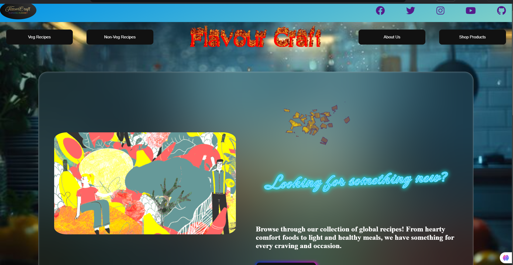
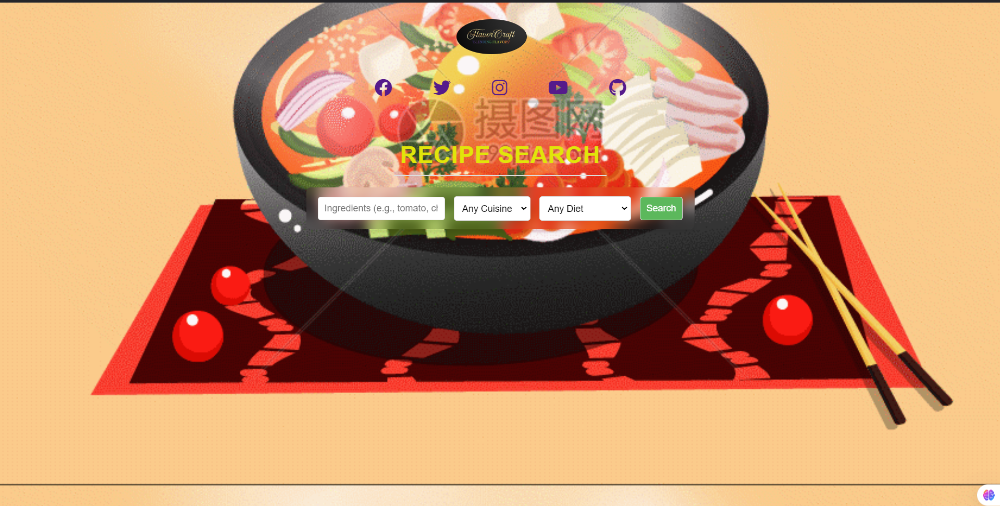

# Recipe Maker Website

## Introduction
The Recipe Maker website is a web-based platform designed to provide users with an intuitive interface to explore, view, and discover a wide variety of recipes. The website showcases different recipes with detailed descriptions, ingredients, and cooking instructions. Each recipe features interactive elements, including images, videos, and social media integrations to enhance the user experience.

## Technologies Used
- **HTML5**: For structuring the content and elements of the web pages.
- **CSS3**: For styling and layout, including animations, grids, and responsive design.
- **JavaScript**: For adding interactivity and dynamic elements.
- **APIs**:
  - Spoonacular API
  - Cloudflare Icons
  - Unsplash API
  - Dicebear API
- **External Resources**:
  - CoolText
  - CSSGradient.io
  - CodePen
  - Dev.to

## Features of the Website
- **Recipe Listings**: Display multiple recipes with title, description, and images.
- **Recipe Detail Page**: Each recipe has a detailed page with ingredients, instructions, and a video.
- **Social Media Integration**: Links to social media profiles and sharing options.

## Deployment
The website is hosted online with API integrations for fetching data and images. The project is deployed and accessible via a public URL.

## Challenges Faced
- API integration
- Responsive design issues
- Animations and effects

## Future Enhancements
- Add user feedback features (rating and comments).
- Implement search functionality.
- Enable user personalization.

## References
1. [Spoonacular API](https://spoonacular.com/)
2. [Cloudflare Icons](https://cdnjs.cloudflare.com/)
3. [Unsplash API](https://unsplash.com/)
4. [Dicebear API](https://www.dicebear.com/)
5. [CoolText](https://cooltext.com/)
6. [CSSGradient.io](https://cssgradient.io/)
7. [CodePen](https://codepen.io/)
8. [Dev.to](https://dev.to/)
9. OpenAI's [ChatGPT](https://chat.openai.com/)
10. Various free internet resources

# Website Screenshots

Here are some screenshots of the website:

